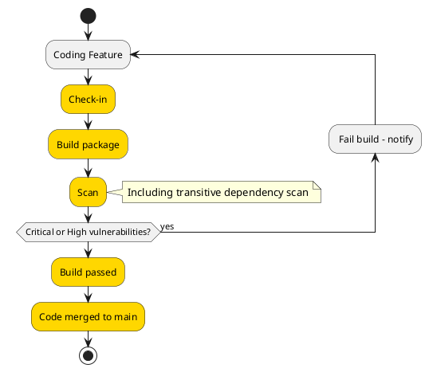
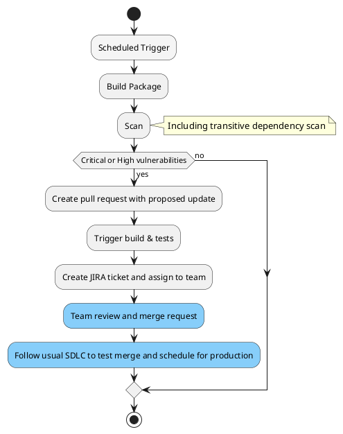

# Package lifecycle management - how we stay on top of vulnerabilities

As distributed, microservice architectures grow in popularity and the volume of open source solutions increase there is an increase in the use of tooling. 

### Why is it important? 
Threats through 3rd party packages & libraries are increasing. 
DevOps principles
A core component of patching vulnerabilities in an application is knowledge of the existence of the vulnerability. However, many developers lack insight into the full array of third-party code that their applications depend upon.

Transitive vulnerabilities are key as well. 

> Key Point: Staying safe & secure is a *shared* responsibility

### What do we need to consider? 
Process for active development and in-situ in production.

What am I developing now
What is in source control
What is running in production/non-production

Considerations depending on branching strategy.

> Key Point: Both tool & process

### Give me an example
- How do we reduce overhead
- Notifications
- SLA/Reporting

Renovate/Dependabot
[Link to security issues](https://github.com/renovatebot/renovate/issues/6562)
[GitHub advisory database now open to community](https://github.blog/2022-02-22-github-advisory-database-now-open-to-community-contributions/)
[Google osv.dev](https://github.com/google/osv.dev)

[OWASP Top 10](https://owasp.org/www-project-top-ten/)
[OWASP A06 - Vulnerable and Outdated Components](https://owasp.org/Top10/A06_2021-Vulnerable_and_Outdated_Components/)
[Synk - Open Source Security Expalined](https://snyk.io/series/open-source-security/)
[Debricked: Vulnerabilities and Dependencies - what you need to know](https://debricked.com/blog/vulnerabilities-dependencies/)
[Microsoft GitHub advanced security for Azure DevOps](https://devblogs.microsoft.com/devops/integrate-security-into-your-developer-workflow-with-github-advanced-security-for-azure-devops/) 
[GitHub advanced security](https://docs.github.com/en/get-started/learning-about-github/about-github-advanced-security)
[GitHub depencency review](https://docs.github.com/en/code-security/supply-chain-security/understanding-your-software-supply-chain/about-dependency-review)
[GitHub dependabot alerts](https://docs.github.com/en/code-security/dependabot/dependabot-alerts/about-dependabot-alerts#dependabot-alerts-for-vulnerable-dependencies)

### What I'm developing now

### What is in source control

> Key Point: Maintain responsibility, but minimise overhead with automation. 

### Changes to consider

Snooze issue option - when no remedy for a CVE exists

> Key Point: Need owners to think about what is next. 