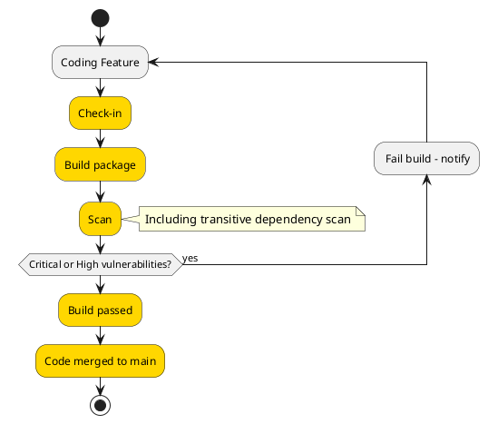
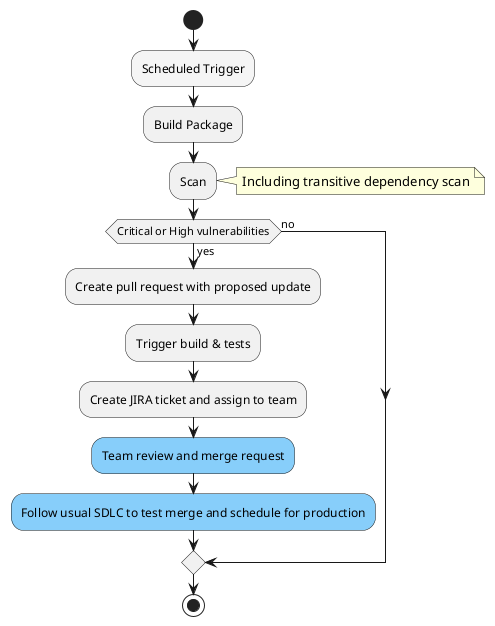

# Package lifecycle management - how we stay on top of vulnerabilities

As distributed, microservice architectures grow in popularity and the volume of open source solutions increase there is an increase in the use of third party tooling and plugins to help deliver components. 

The flexibility and ease of leveraging existing components is well versed, with the majority of popular programming languages support methods of defining and downloading packages or extensions. This greatly simplifies the work required for developers to build features, as we re-use common components (logging, hosting, queues) and focus the time on the logic that is truly unique to the feature. 

But it shifts some of the responsibility for what is packaged out to 3rd parties who produce the software. They themselves leverage the same model to simplify development, creating a supply chain of third party components used to delver a feature. 

**TODO**: Insert diagram for the rise of plugins available. 

Sadly, with the rise of package usage comes the threat of attack. With operating system patching procedures maturing in organisations, attackers are turning to other methods to exploit vulnerabilities. 

One approach is exploiting common components whether direct or transitive. This involves finding weaknesses in commonly used components and exploiting it across multiple organisations. 

### What are transitive vulnerabilities? 

**TODO**: Insert diagram for the transitive issue.  

One well known example was the zero-day [Log4Shell](https://www.dynatrace.com/news/blog/what-is-log4shell/) which was identified in 2021 and estimated to have affected hundreds of million devices with [93% of enterprises cloud environments affected](https://www.wiz.io/blog/10-days-later-enterprises-halfway-through-patching-log4shell). 

> The results were striking: While 93% of all cloud environments are at risk from Log4Shell, on average organizations have patched 45% of their vulnerable cloud resources by Day 10 (December 20, 2021). - [Wiz & EY, Dec 2021](https://www.wiz.io/blog/10-days-later-enterprises-halfway-through-patching-log4shell)

The weakness here is often exacerbated by the lack of process maturity of package management. Organisation often have an insufficient view of which packages are used in the organisation with low maturity on a process to actively monitor and patch packages leading to outdated components.

A core component of patching vulnerabilities in an application is knowledge of the existence of the vulnerability. However, many developers lack insight into the full array of third-party code that their applications depend upon.

This issue is so significant it is one of the [OWASP Top 10](https://owasp.org/Top10/A06_2021-Vulnerable_and_Outdated_Components/) issues. And the trend is increasing, moving from 9th position in 2017 to 6th in 2022.  

The good news is with this rise of threat we are seeing a response in [new tooling](https://github.com/google/osv.dev) and processes to help better manage and mitigate 3rd party package vulnerabilities, whilst still leveraging the flexibility that packages provide. 

Putting in place tooling, processes and a culture to make vulnerability management a first class citizen is key to managing. And it isn't just tooling,

> Staying safe & secure is a *shared* responsibility 

### What do we need to consider? 
Process for active development and in-situ in production.

What am I developing now
What is in source control
What is running in production/non-production

Considerations depending on branching strategy.

> Key Point: Both tool & process

### Give me an example
- How do we reduce overhead
- Notifications
- SLA/Reporting

Renovate/Dependabot
[Link to security issues](https://github.com/renovatebot/renovate/issues/6562)
[GitHub advisory database now open to community](https://github.blog/2022-02-22-github-advisory-database-now-open-to-community-contributions/)
[Google osv.dev](https://github.com/google/osv.dev)

[OWASP Top 10](https://owasp.org/www-project-top-ten/)
[OWASP A06 - Vulnerable and Outdated Components](https://owasp.org/Top10/A06_2021-Vulnerable_and_Outdated_Components/)
[Synk - Open Source Security Expalined](https://snyk.io/series/open-source-security/)
[Debricked: Vulnerabilities and Dependencies - what you need to know](https://debricked.com/blog/vulnerabilities-dependencies/)
[Microsoft GitHub advanced security for Azure DevOps](https://devblogs.microsoft.com/devops/integrate-security-into-your-developer-workflow-with-github-advanced-security-for-azure-devops/) 
[GitHub advanced security](https://docs.github.com/en/get-started/learning-about-github/about-github-advanced-security)
[GitHub depencency review](https://docs.github.com/en/code-security/supply-chain-security/understanding-your-software-supply-chain/about-dependency-review)
[GitHub dependabot alerts](https://docs.github.com/en/code-security/dependabot/dependabot-alerts/about-dependabot-alerts#dependabot-alerts-for-vulnerable-dependencies)

### What I'm developing now

### What is in source control

> Key Point: Maintain responsibility, but minimise overhead with automation. 

### Changes to consider

Snooze issue option - when no remedy for a CVE exists

> Key Point: Need owners to think about what is next. 