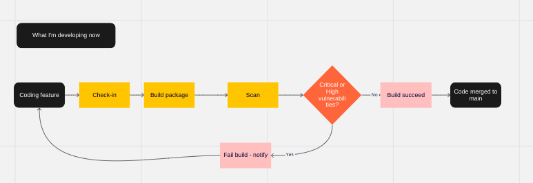

# Package lifecycle management - how we stay on top of vulnerabilities

### Why is it important? 
Threats through 3rd party packages & libraries are increasing. 
DevOps principles
A core component of patching vulnerabilities in an application is knowledge of the existence of the vulnerability. However, many developers lack insight into the full array of third-party code that their applications depend upon.

Transitive vulnerabilities are key as well. 

> Key Point: Staying safe & secure is *our* responsibility

### What do we need to consider? 
Process for active development and in-situ in production.

What am I developing now
What is in source control
What is running in production/non-production

Considerations depending on branching strategy.

> Key Point: Both tool & process

### Give me an example
- How do we reduce overhead
- Notifications
- SLA/Reporting

Renovate/Dependabot
[Link to security issues](https://github.com/renovatebot/renovate/issues/6562)
[GitHub advisory database now open to community](https://github.blog/2022-02-22-github-advisory-database-now-open-to-community-contributions/)
[Google osv.dev](https://github.com/google/osv.dev)

> Key Point: Maintain responsibility, but minimise overhead with automation. 

### Changes to consider

Snooze issue option - when no remedy for a CVE exists

> Key Point: Need owners to think about what is next. 